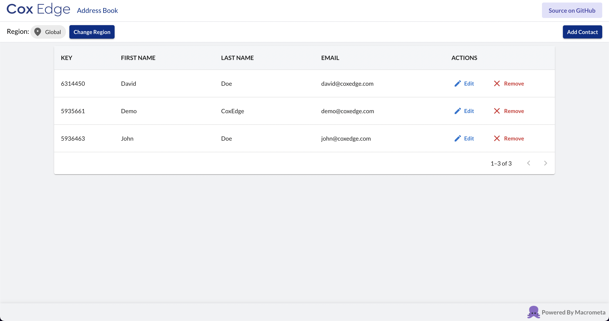

# Global Address Book

### Live Demo: https://macrometacorp.github.io/tutorial-addressbook-streams-coxedge/

Demo to show a Real-time adrress book!

## Setup

| **Federation**                                        | **Email**          | **Passsword** |
| ----------------------------------------------------- | ------------------ | ------------- |
| [Global Data Network](https://gdn.paas.macrometa.io/) | demo@macrometa.com | `xxxxxxxx`    |

## Overview

**Dashboard:**



### Macrometa Account setup

1. Create the following collections with stream in your Macrometa account.

```
addresses(global)
```

2. Deploy locally. 
 
First, clone the repository and `cd` to your new directory.
```
git clone git@github.com:Macrometacorp/tutorial-addressbook-streams.git
```
```
cd tutorial-addressbook-streams
```

Then, install the project's dependencies.
```
npm install
```
Finally, run it locally.
```
npm run start
```

3. The GDN url and API key have to be provided in `src/util/constants.js` file. The user will then be asked to select one region in the GUI.

4. Deploy on GH Pages:

```
npm run deploy
```
